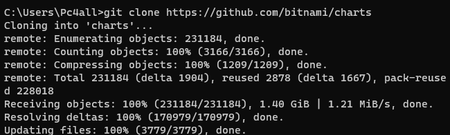

# -Final-Project-Assessment-for-Scalefocus-Academy
1. After downloading required tools i have cloned the github repo for bitnami

Then problem encountered when deploying the chart

Jenkins pipeline:
pipeline {
    agent any
    options {
        skipStagesAfterUnstable()
    }
    
        stage('Test'){
            steps {
                script{
                def deploymentExists = bat(script: 'kubectl get deployment final-project-wp-scalefocus -n wp', returnStatus: true) == 0
             if (deploymentExists) {
               echo 'WordPress is already installed'
             } else {
               echo 'WordPress is not installed. Proceed with the deployment.'
             }
             }
             }
            }
        }
        stage('Deploy') {
            steps {
                sh 'make publish'
              
            }
        }
    }
}

I have encountered errors during deployment and i have tried to fixed them but unsuccessfully.
